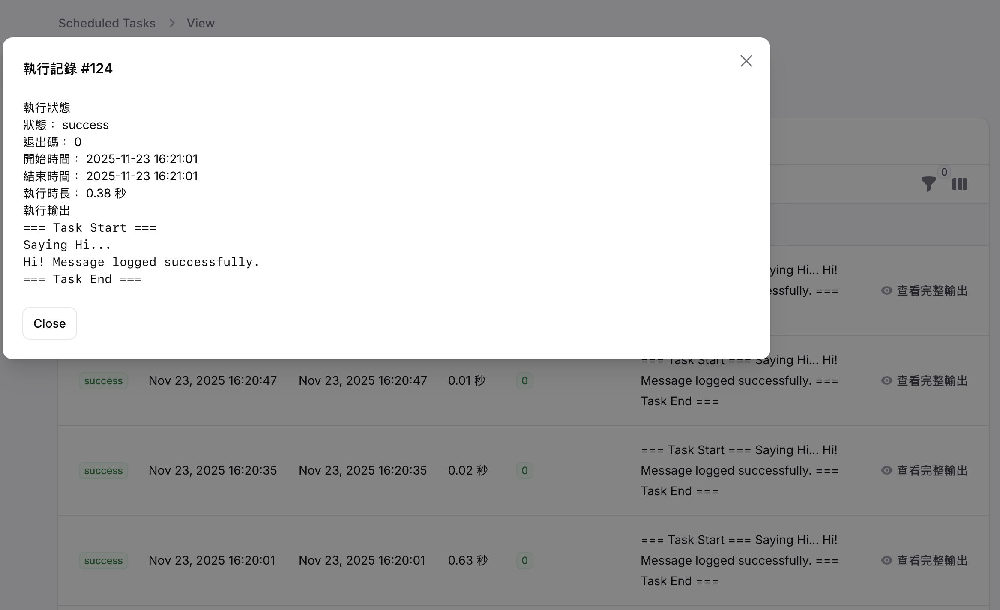

# Filament Schedule UI

[](https://packagist.org/packages/advsorcer/filament-schedule-ui)
[](https://packagist.org/packages/advsorcer/filament-schedule-ui)
[](https://laravel.com)
[](https://www.php.net)
[](LICENSE)
[](https://github.com/AdvSorcer/Filament-Schedule-UI/actions)

English | [繁體中文](README.md)

A Laravel schedule management tool based on Filament that allows you to easily manage and monitor all scheduled tasks in the admin interface.


Execution Messages




## System Requirements

- PHP >= 8.3
- Laravel >= 12.0
- Filament >= 4.0
- Composer

## Installation Steps

### 1. Install Package

```bash
composer require advsorcer/filament-schedule-ui
```

### 2. Install Filament Panel (if not already installed)

```bash
php artisan filament:install --panels
```

### 3. Create Filament User (if not already created)

```bash
php artisan make:filament-user
```

### 4. Publish Configuration

```bash
php artisan vendor:publish --tag=filament-schedule-ui-config
```

This will publish the configuration file to `config/filament-schedule-ui.php`.

### 5. Publish and Run Migrations

```bash
php artisan vendor:publish --tag=filament-schedule-ui-migrations
php artisan migrate
```

### 6. Register Plugin in Filament Panel

Register the plugin in your Filament Panel Provider (usually `app/Providers/Filament/AdminPanelProvider.php`):

```php
use AdvSorcer\FilamentScheduleUI\FilamentScheduleUIPlugin;

public function panel(Panel $panel): Panel
{
    return $panel
        // ... other configurations
        ->plugin(FilamentScheduleUIPlugin::make());
}
```

### 7. Configure Language (Optional)

If you need to customize language files, publish the language files:

```bash
php artisan vendor:publish --tag=filament-schedule-ui-lang
```

Then set the language in `.env`:

```
FILAMENT_SCHEDULE_UI_LOCALE=en
# or
FILAMENT_SCHEDULE_UI_LOCALE=zh_TW
```

Default is `zh_TW` (Traditional Chinese).

## Features

### 📋 Schedule Management
- **Auto Sync**
- **Schedule List**
- **Enable/Disable**
- **Run Now**
- **Complete Logging**
- **Execution Status**
- **Execution Output**
- **Execution Duration**
- **Error Tracking**


## Usage

### 1. Initial Setup

### Example

Define schedules in `routes/console.php`:

```php
// Test schedule: runs every ten minutes
schedule_command('say:good-evening')
    ->everyTenMinutes()
    ->description('Say good evening every ten minutes');
```

After logging into the admin panel, you need to sync schedules from code to the database for the first time:

1. Go to the "Scheduled Tasks" page in the Filament admin panel
2. Click the "Sync Schedules" button in the top right corner
3. The system will automatically scan and sync all scheduled tasks


### ⚠️ Important Reminder

If you create a new Artisan command, remember to register it in `routes/console.php` using `schedule_command`, then execute "Sync Schedules" in the admin panel for it to appear in the UI.


### LazySample
```php
<?php

namespace App\Console\Commands;

use Illuminate\Console\Command;

class SayGoodEveningCommand extends Command
{
    protected $signature = 'say:good-evening';

    protected $description = 'Say good evening in the log';

    public function handle(): int
    {
        $this->info('=== Task Start ===');
        $this->info('Saying Good Evening...');
        \Log::info('Say Good Evening: '.now()->toDateTimeString());
        $this->info('=== Task End ===');

        return Command::SUCCESS;
    }
}
```
